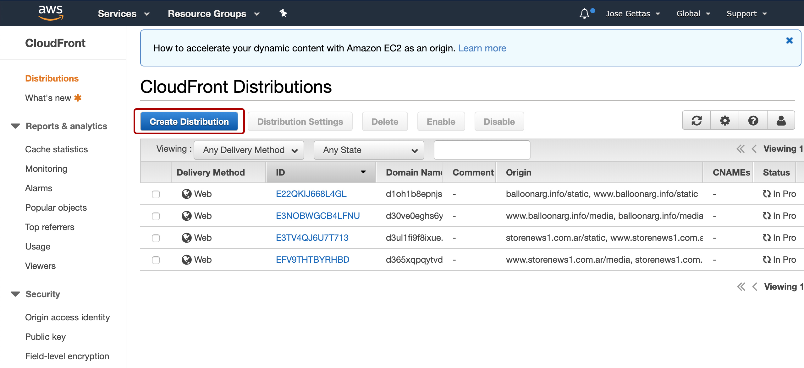
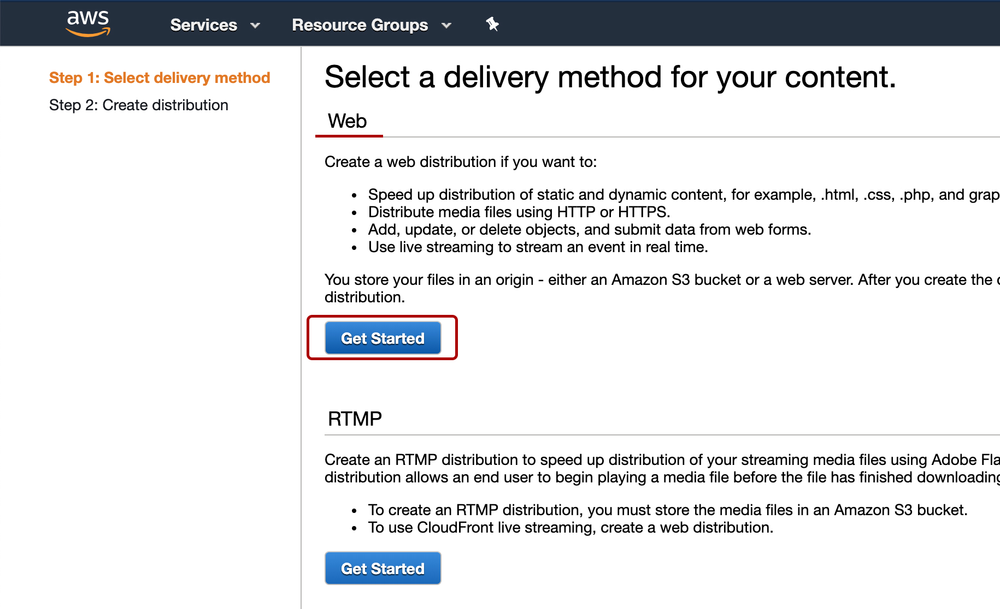
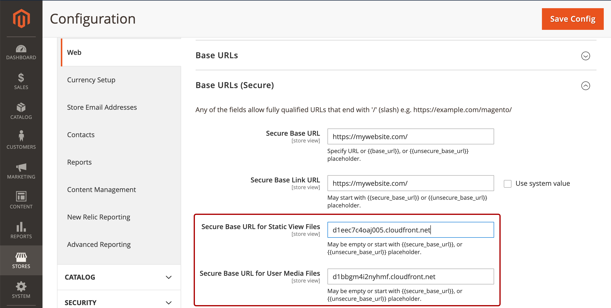
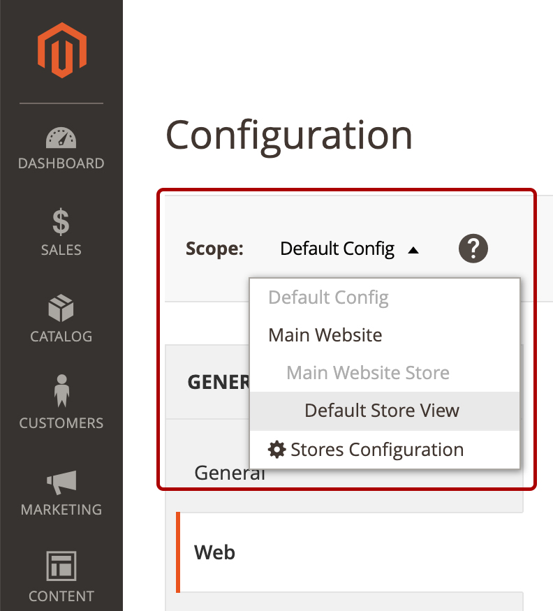

# Instale Magento 2.3.4 en AWS Ubuntu 18.04 SSL completo con Nginx Redis Varnish y Cloudfront

## Preparación de la instalación

Inicializamos una instancia con Ubuntu 18.04, t2.medium (recomendado) y creamos/utilizamos un grupo de seguridad con -> SSH Port 22 IP (la ip donde desde donde se va a acceder) | HTTP Port 80 0.0.0.0 (default) | HTTPS Port 443 0.0.0.0 (default)

Esperamos a que arranque la instancia e ingresamos via SSH. Una vez dentro corremos estos comandos:
```
sudo apt update && sudo apt upgrade
sudo apt install unzip certbot
sudo apt-get -y install nginx
sudo apt install mariadb-server
```

Aseguramos la base de datos:
```
sudo mysql_secure_installation
```

La configuracion para la seguridad es la siguiente (similar a lo que veras en la consola):
```
Enter current password for root (enter for none): **INGRESAMOS NUEVA PASS**
Change the root password?: **Y**
New password: **INGRESAMOS LA PASS DE RECIEN**
Re-enter new password: **INGRESAMOS LA PASS DE RECIEN DE NUEVO**
Remove anonymous users?: **Y**
Disallow root login remotely?: **n**
Remove test database and access to it?: **n**
Reload privilege tables now?: **Y**
```

Ingresamos a la base de datos con `sudo mysql` y ejecutamos los siguientes comandos uno por uno:
```
CREATE DATABASE magentodb;
GRANT ALL PRIVILEGES ON magentodb.* TO 'magentouser'@'localhost' IDENTIFIED BY '**putyourpasswordhere**';
FLUSH PRIVILEGES;
exit;
```

A continuación creamos el usuario, grupo, carpeta de magento y le otorgamos los permisos correctos:
```
sudo useradd -m -U -r -d /opt/magento magento
sudo usermod -a -G magento www-data
sudo chmod 750 /opt/magento
```

Ahora instalamos las dependencias de php:
```
sudo apt install php7.2-common php7.2-cli php7.2-fpm php7.2-opcache php7.2-gd php7.2-mysql php7.2-curl php7.2-intl php7.2-xsl php7.2-mbstring php7.2-zip php7.2-bcmath php7.2-soap
```

Y configuramos los parámetros de php para cumplir los requisitos de Magento:
```
sudo sed -i "s/memory_limit = .*/memory_limit = 2048M/" /etc/php/7.2/fpm/php.ini
sudo sed -i "s/upload_max_filesize = .*/upload_max_filesize = 256M/" /etc/php/7.2/fpm/php.ini
sudo sed -i "s/zlib.output_compression = .*/zlib.output_compression = on/" /etc/php/7.2/fpm/php.ini
sudo sed -i "s/max_execution_time = .*/max_execution_time = 18000/" /etc/php/7.2/fpm/php.ini
sudo sed -i "s/;date.timezone.*/date.timezone = UTC/" /etc/php/7.2/fpm/php.ini
sudo sed -i "s/;opcache.save_comments.*/opcache.save_comments = 1/" /etc/php/7.2/fpm/php.ini
```

Ahora creamos un archivo de configuración de php magento:
```
sudo nano /etc/php/7.2/fpm/pool.d/magento.conf
```

Y le agregamos la siguiente configuración
```
[magento]
user = magento
group = www-data
listen.owner = magento
listen.group = www-data
listen = /var/run/php/php7.2-fpm-magento.sock
pm = ondemand
pm.max_children = 50
pm.process_idle_timeout = 10s
pm.max_requests = 500
chdir = /
```

Reiniciamos PHP FPM para recargar la configuración:
```
sudo systemctl restart php7.2-fpm
```

Finalmente obtenemos composer y lo instalamos localmente:
```
curl -sS https://getcomposer.org/installer | sudo php
sudo mv composer.phar /usr/local/bin/composer
```

## Instalación - Certificado SSL:

Primero stopeamos nginx:
```
sudo systemctl stop nginx
```

Para una mejor seguridad, queremos generar parámetros Diffie-Hellman lo suficientemente fuertes:
```
sudo openssl dhparam -out /etc/ssl/certs/dhparam.pem 2048
```

Ahora cambiamos al usuario root y creamos la carpeta let’s encrypt y le otorgamos el grupo y los permisos correctos:
```
sudo su
mkdir -p /var/lib/letsencrypt/.well-known
chgrp www-data /var/lib/letsencrypt
chmod g+s /var/lib/letsencrypt
**Salimos del usuario 'root'**
exit
```

Tendremos que integrar esto con nginx, así que creamos un fragmento que usaremos más adelante en nuestro archivo de configuración nginx:
```
sudo nano /etc/nginx/snippets/letsencrypt.conf
```

Y le agregamos:
```
location ^~ /.well-known/acme-challenge/ {
    allow all;
    root /var/lib/letsencrypt/;
    default_type “text/plain”;
    try_files $uri =404;
}
```

Ahora creamos nuestro archivo de configuración nginx para poder responder a los desafíos del servidor de certificados EFF (virtual host):
```
sudo nano /etc/nginx/sites-available/**mywebsite.com**
```

Y le agregamos:
```
upstream fastcgi_backend {
    server unix:/run/php/php7.2-fpm.sock;
}
server {
    server_name **mywebsite.com**;
    listen 80;
    include snippets/letsencrypt.conf;
}
```

Creamos un enlace simbólico para habilitar la configuración (virtual host):
```
sudo ln -s /etc/nginx/sites-available/**mywebsite.com** /etc/nginx/sites-enabled/**mywebsite.com**
```

Eliminamos los archivos de configuración por default:
```
sudo rm -f /etc/nginx/sites-enabled/default
sudo rm -f /etc/nginx/sites-available/default
```

Volvemos a iniciar nginx:
```
sudo service nginx start
```

Finalmente, generamos el certificado (debemos ingresar nuestra dirección de correo electrónico y seguir las instrucciones):
```
sudo certbot certonly --agree-tos --email **myemail@gmail.com** --webroot -w /var/lib/letsencrypt/ -d **mywebsite.com**
```

El certificado generado tiene una validez de 90 días pero es renovable. No es necesario configurar una alarma, creamos un trabajo cron para que lo haga automáticamente:
```
sudo nano /etc/cron.d/certbot
```

Y agregamos lo siguiente debajo de la linea similar que se encuentra en el archivo (esta linea que es similar la debemos comentar utilizando el '#' por delante):
```
0 */12 * * * root test -x /usr/bin/certbot -a \! -d /run/systemd/system && perl -e 'sleep int(rand(3600))' && certbot -q renew — renew-hook "systemctl reload nginx"
```

## Instalación - Magento:

Ahora que tenemos todos los requisitos previos y un certificado SSL válido, instalaremos Magento a través de composer. Necesitamos cambiar al usuario de magento para realizar la instalación (tengamos a mano las keys para instalar magento).
```
sudo su — magento
composer create-project --repository-url=https://repo.magento.com/ magento/project-community-edition /opt/magento/public_html/
cd ~/public_html
```

Y aquí está el comando principal que instalará mágicamente Magento:
```
php bin/magento setup:install --base-url=**https://mywebsite.com/** \
--base-url-secure=**https://mywebsite.com/** \
--admin-firstname=**Firstname** \
--admin-lastname=**Lastname** \
--admin-email=**mymail@mail.com** \
--admin-user=**NewUser** \
--admin-password=**YourPasswordHere** \
--db-host=**localhost** \
--db-name=**magentodb** \
--db-user=**magentodbuser** \
--db-password=**magentodbpassword** \
--ßßßcurrency=USD \
--timezone=America/Chicago \
--use-rewrites=1
```

Ahora configuremos los cron jobs:
```
php ~/public_html/bin/magento cron:install
```

Una vez instalado, el último paso antes de tener un magento en funcionamiento es modificar el archivo de configuración nginx para reenviar las llamadas http a https y servir el sitio magento a través de https (virtual host).

Debemos cambiar el contenido del virtul host actual por el siguiente:
```
sudo nano /etc/nginx/sites-available/**mywebsite.com**

upstream fastcgi_backend {
    server unix:/var/run/php/php7.2-fpm-magento.sock;
}
server {
    listen 80;
    server_name **mywebsite.com**;

    include snippets/letsencrypt.conf;
    return 301 **https://mywebsite.com**$request_uri;
}
server {
    listen 443 ssl http2;
    server_name **mywebsite.com**;
    ssl_certificate /etc/letsencrypt/live/**mywebsite.com**/fullchain.pem;
    ssl_certificate_key /etc/letsencrypt/live/**mywebsite.com**/privkey.pem;
    ssl_trusted_certificate /etc/letsencrypt/live/**mywebsite.com**/chain.pem;
    ssl_dhparam /etc/ssl/certs/dhparam.pem;
    ssl_session_timeout 1d;
    ssl_session_cache shared:SSL:50m;
    ssl_session_tickets off;
    ssl_protocols TLSv1 TLSv1.1 TLSv1.2;
    ssl_ciphers HIGH:!aNULL:!MD5;
    ssl_prefer_server_ciphers on;
    ssl_stapling on;
    ssl_stapling_verify on;
    resolver 8.8.8.8 8.8.4.4 valid=300s;
    resolver_timeout 30s;
    keepalive_timeout 300s;
    add_header Strict-Transport-Security "max-age=15768000";
    add_header X-Frame-Options SAMEORIGIN;
    add_header X-Content-Type-Options nosniff;
    include snippets/letsencrypt.conf;
    set $MAGE_ROOT /opt/magento/public_html;
    set $MAGE_MODE developer; # or production
    access_log /var/log/nginx/magento-**mywebsite.com**-access.log;
    error_log /var/log/nginx/magento-**mywebsite.com**-error.log;
    include /opt/magento/public_html/nginx.conf.sample;
}
```

Primero probamos que el archivo de configuración esté libre de errores:
```
sudo nginx -t
```

Y finalmente volvemos a cargar la configuración nginx (o reinicie o ambas para estar seguro):
```
sudo service nginx reload
sudo service nginx restart
```

## Instalación y configuración de un Redis seguro para el almacenamiento en caché de la sesión

```
sudo apt-get install redis-server
```

Agreguémoslo a los servicios de inicio:
```
sudo update-rc.d redis-server defaults
```

Ahora asegurémoslo:
```
sudo nano /etc/redis/redis.conf
```

Después de abrir el archivo de configuración, asegúrese de que la línea de enlace no tenga comentarios y descomente la línea de contraseña agregando una contraseña segura como se muestra a continuación:
```
...
bind 127.0.0.1 ::1
...
...
# requirepass foobared
requirepass **replacewithyourpassword**
```

Finalmente reinicie el servicio:
```
sudo systemctl restart redis.service
```

_(Antes de realizar el siguiente paso de configuraciond de Redis debemos darle permisos 777 a algunas carpetas de la instalacion de magento desde el usuario `sudo su`)_
```
sudo su 
cd /opt/magento/public_html
chmod -R 777 var/*
chmod -R 777 app/*
chmod -R 777 pub/*
chmod -R 777 generated/*
```

Ahora que hemos instalado Redis y lo hemos asegurado, necesitamos habilitarlo en Magento. Hazlo con el siguiente comando. Y no olvide ingresar su contraseña de Redis en el comando; de lo contrario, obtendrá un error 500:
```
bin/magento setup:config:set --session-save=redis --session-save-redis-host=127.0.0.1 --session-save-redis-log-level=3 --session-save-redis-db=2 --session-save-redis-password **replacewithyourpassword**
```

## Instalación y configuración de Varnish para el almacenamiento en caché de página completa

```
sudo apt-get install varnish
```

Ingresamos al admin de Magento y obtenemos el archivo de configuración de Varnish:

Clickeamos en **STORES > Settings > Configuration > ADVANCED > System > Full Page Cache**

Habilitamos Varnish y en la configuración del mismo seleccionamos Export VCL for Varnish 6.

Al tenerlo descargado renombramos la configuracion de Varnish que viene por default:
```
sudo mv /etc/varnish/default.vcl /etc/varnish/default.vcl.Original
```

Creamos la nueva configuración:
```
sudo nano -f /etc/varnish/default.vcl
```

Y pegamos dentro el codigo que exportamos de Varnish (el archivo suele llamarse varnish.vcl)
_**(IMPORTANTE! Hay un bug en el codigo que exportamos, vamos a encontrar que dice ".url = "/pub/health_check.php";", debemos quitar el /pub)**_
```
# VCL version 5.0 is not supported so it should be 4.0 even though actually used Varnish version is 6
vcl 4.0;

import std;
# The minimal Varnish version is 6.0
# For SSL offloading, pass the following header in your proxy server or load balancer: 'X-Forwarded-Proto: https'

backend default {
    .host = "localhost";
    .port = "8080";
    .first_byte_timeout = 600s;
    .probe = {
        .url = "/health_check.php";
        .timeout = 2s;
        .interval = 5s;
        .window = 10;
        .threshold = 5;
    }
}

acl purge {
    "localhost";
}

sub vcl_recv {
    if (req.method == "PURGE") {
        if (client.ip !~ purge) {
            return (synth(405, "Method not allowed"));
        }
        # To use the X-Pool header for purging varnish during automated deployments, make sure the X-Pool header
        # has been added to the response in your backend server config. This is used, for example, by the
        # capistrano-magento2 gem for purging old content from varnish during it's deploy routine.
        if (!req.http.X-Magento-Tags-Pattern && !req.http.X-Pool) {
            return (synth(400, "X-Magento-Tags-Pattern or X-Pool header required"));
        }
        if (req.http.X-Magento-Tags-Pattern) {
            ban("obj.http.X-Magento-Tags ~ " + req.http.X-Magento-Tags-Pattern);
        }
        if (req.http.X-Pool) {
            ban("obj.http.X-Pool ~ " + req.http.X-Pool);
        }
        return (synth(200, "Purged"));
    }

    if (req.method != "GET" &&
        req.method != "HEAD" &&
        req.method != "PUT" &&
        req.method != "POST" &&
        req.method != "TRACE" &&
        req.method != "OPTIONS" &&
        req.method != "DELETE") {
        /* Non-RFC2616 or CONNECT which is weird. */
        return (pipe);
    }

    # We only deal with GET and HEAD by default
    if (req.method != "GET" && req.method != "HEAD") {
        return (pass);
    }

    # Bypass shopping cart, checkout and search requests
    if (req.url ~ "/checkout" || req.url ~ "/catalogsearch") {
        return (pass);
    }

    # Bypass health check requests
    if (req.url ~ "/pub/health_check.php") {
        return (pass);
    }

    # Set initial grace period usage status
    set req.http.grace = "none";

    # normalize url in case of leading HTTP scheme and domain
    set req.url = regsub(req.url, "^http[s]?://", "");

    # collect all cookies
    std.collect(req.http.Cookie);

    # Compression filter. See https://www.varnish-cache.org/trac/wiki/FAQ/Compression
    if (req.http.Accept-Encoding) {
        if (req.url ~ "\.(jpg|jpeg|png|gif|gz|tgz|bz2|tbz|mp3|ogg|swf|flv)$") {
            # No point in compressing these
            unset req.http.Accept-Encoding;
        } elsif (req.http.Accept-Encoding ~ "gzip") {
            set req.http.Accept-Encoding = "gzip";
        } elsif (req.http.Accept-Encoding ~ "deflate" && req.http.user-agent !~ "MSIE") {
            set req.http.Accept-Encoding = "deflate";
        } else {
            # unknown algorithm
            unset req.http.Accept-Encoding;
        }
    }

    # Remove all marketing get parameters to minimize the cache objects
    if (req.url ~ "(\?|&)(gclid|cx|ie|cof|siteurl|zanpid|origin|fbclid|mc_[a-z]+|utm_[a-z]+|_bta_[a-z]+)=") {
        set req.url = regsuball(req.url, "(gclid|cx|ie|cof|siteurl|zanpid|origin|fbclid|mc_[a-z]+|utm_[a-z]+|_bta_[a-z]+)=[-_A-z0-9+()%.]+&?", "");
        set req.url = regsub(req.url, "[?|&]+$", "");
    }

    # Static files caching
    if (req.url ~ "^/(pub/)?(media|static)/") {
        # Static files should not be cached by default
        return (pass);

        # But if you use a few locales and don't use CDN you can enable caching static files by commenting previous line (#return (pass);) and uncommenting next 3 lines
        #unset req.http.Https;
        #unset req.http.X-Forwarded-Proto;
        #unset req.http.Cookie;
    }

    return (hash);
}

sub vcl_hash {
    if (req.http.cookie ~ "X-Magento-Vary=") {
        hash_data(regsub(req.http.cookie, "^.*?X-Magento-Vary=([^;]+);*.*$", "\1"));
    }

    # For multi site configurations to not cache each other's content
    if (req.http.host) {
        hash_data(req.http.host);
    } else {
        hash_data(server.ip);
    }

    # To make sure http users don't see ssl warning
    if (req.http.X-Forwarded-Proto) {
        hash_data(req.http.X-Forwarded-Proto);
    }
    

    if (req.url ~ "/graphql") {
        call process_graphql_headers;
    }
}

sub process_graphql_headers {
    if (req.http.Store) {
        hash_data(req.http.Store);
    }
    if (req.http.Content-Currency) {
        hash_data(req.http.Content-Currency);
    }
}

sub vcl_backend_response {

    set beresp.grace = 3d;

    if (beresp.http.content-type ~ "text") {
        set beresp.do_esi = true;
    }

    if (bereq.url ~ "\.js$" || beresp.http.content-type ~ "text") {
        set beresp.do_gzip = true;
    }

    if (beresp.http.X-Magento-Debug) {
        set beresp.http.X-Magento-Cache-Control = beresp.http.Cache-Control;
    }

    # cache only successfully responses and 404s
    if (beresp.status != 200 && beresp.status != 404) {
        set beresp.ttl = 0s;
        set beresp.uncacheable = true;
        return (deliver);
    } elsif (beresp.http.Cache-Control ~ "private") {
        set beresp.uncacheable = true;
        set beresp.ttl = 86400s;
        return (deliver);
    }

    # validate if we need to cache it and prevent from setting cookie
    if (beresp.ttl > 0s && (bereq.method == "GET" || bereq.method == "HEAD")) {
        unset beresp.http.set-cookie;
    }

    # If page is not cacheable then bypass varnish for 2 minutes as Hit-For-Pass
    if (beresp.ttl <= 0s ||
        beresp.http.Surrogate-control ~ "no-store" ||
        (!beresp.http.Surrogate-Control &&
        beresp.http.Cache-Control ~ "no-cache|no-store") ||
        beresp.http.Vary == "*") {
            # Mark as Hit-For-Pass for the next 2 minutes
            set beresp.ttl = 120s;
            set beresp.uncacheable = true;
        }

    return (deliver);
}

sub vcl_deliver {
    if (resp.http.X-Magento-Debug) {
        if (resp.http.x-varnish ~ " ") {
            set resp.http.X-Magento-Cache-Debug = "HIT";
            set resp.http.Grace = req.http.grace;
        } else {
            set resp.http.X-Magento-Cache-Debug = "MISS";
        }
    } else {
        unset resp.http.Age;
    }

    # Not letting browser to cache non-static files.
    if (resp.http.Cache-Control !~ "private" && req.url !~ "^/(pub/)?(media|static)/") {
        set resp.http.Pragma = "no-cache";
        set resp.http.Expires = "-1";
        set resp.http.Cache-Control = "no-store, no-cache, must-revalidate, max-age=0";
    }

    unset resp.http.X-Magento-Debug;
    unset resp.http.X-Magento-Tags;
    unset resp.http.X-Powered-By;
    unset resp.http.Server;
    unset resp.http.X-Varnish;
    unset resp.http.Via;
    unset resp.http.Link;
}

sub vcl_hit {
    if (obj.ttl >= 0s) {
        # Hit within TTL period
        return (deliver);
    }
    if (std.healthy(req.backend_hint)) {
        if (obj.ttl + 300s > 0s) {
            # Hit after TTL expiration, but within grace period
            set req.http.grace = "normal (healthy server)";
            return (deliver);
        } else {
            # Hit after TTL and grace expiration
            return (restart);
        }
    } else {
        # server is not healthy, retrieve from cache
        set req.http.grace = "unlimited (unhealthy server)";
        return (deliver);
    }
}
```

Finalmente, necesitamos editar el archivo de configuración de Nginx para indicarle que enrute las llamadas que llegan en el puerto 443 (https) al puerto Varnish 6081.

Debemos actualizar el archivo de virtual host con la siguiente informacion (en muchas partes es igual, se puede editar pero recomiendo que se renombre y que se asigne la nueva informacion por completo):
```
upstream fastcgi_backend {
    server unix:/run/php/php7.2-fpm.sock;
}

server {
    listen 443 ssl http2;
    server_name **mywebsite.com**;
    ssl_certificate /etc/letsencrypt/live/**mywebsite.com**/fullchain.pem;
    ssl_certificate_key /etc/letsencrypt/live/**mywebsite.com**/privkey.pem;
    ssl_trusted_certificate /etc/letsencrypt/live/**mywebsite.com**/chain.pem;
    ssl_dhparam /etc/ssl/certs/dhparam.pem;
    ssl_session_timeout 1d;
    ssl_session_cache shared:SSL:50m;
    ssl_session_tickets off;
    ssl_protocols TLSv1 TLSv1.1 TLSv1.2;
    ssl_ciphers HIGH:!aNULL:!MD5;
    ssl_prefer_server_ciphers on;
    ssl_stapling on;
    ssl_stapling_verify on;
    resolver 8.8.8.8 8.8.4.4 valid=300s;
    resolver_timeout 30s;
    keepalive_timeout 300s;
    location / {
        proxy_pass http://127.0.0.1:6081;
        proxy_set_header Host $http_host;
        proxy_set_header X-Forwarded-Host $http_host;
        proxy_set_header X-Real-IP $remote_addr;
        proxy_set_header X-Forwarded-For $proxy_add_x_forwarded_for;
        proxy_set_header Ssl-Offloaded "1";
        proxy_set_header X-Forwarded-Proto https;
        proxy_set_header X-Forwarded-Port 443;
        #proxy_hide_header X-Varnish;
        #proxy_hide_header Via;
        proxy_set_header X-Forwarded-Proto $scheme;
        proxy_headers_hash_max_size 512;
        proxy_headers_hash_bucket_size 128; 
    }
}
server {
    server_name **mywebsite.com**;
    listen 8080;
    add_header Strict-Transport-Security "max-age=15768000; includeSubdomains; preload;";
    add_header X-Frame-Options SAMEORIGIN;
    add_header X-Content-Type-Options nosniff;
    include snippets/letsencrypt.conf;
    set $MAGE_ROOT /opt/magento/public_html;
    set $MAGE_MODE production; # or production
    access_log /var/log/nginx/magento-**mywebsite.com**-access.log;
    error_log /var/log/nginx/magento-**mywebsite.com**-error.log;
    include /opt/magento/public_html/nginx.conf.sample;
}
```

_(Para renombrar y asignar la nueva informacion por completo debemos hacer lo siguiente)_
```
sudo mv /etc/nginx/sites-available/**mywebsite.com** /etc/nginx/sites-available/**mywebsite.com.Original**
sudo nano /etc/nginx/sites-available/**mywebsite.com**
_Pegar la información por completo que se definio en el paso de arriba_
```

Continuamos y ahora vamos a darle algunos parámetros más a nuestro Varnish editando el siguiente archivo:
```
sudo nano /etc/default/varnish

_Buscamos este fragmento del codigo:_
## Alternative 2, Configuration with VCL
#
# Listen on port 6081, administration on localhost:6082, and forward to
# one content server selected by the vcl file, based on the request.
#
#DAEMON_OPTS="-a :6081 \
#             -T localhost:6082 \
#             -f /etc/varnish/default.vcl \
#             -S /etc/varnish/secret \
#             -s malloc,256m"

_Y debajo de este (que debemos comentar) pegamos este otro fragmento_
DAEMON_OPTS="-a :6081 \
    -T localhost:6082 \
    -f /etc/varnish/default.vcl \
    -p thread_pools=4 \
    -p thread_pool_max=1500 \
    -p connect_timeout=300 \
    -p http_resp_hdr_len=65536 \
    -p http_resp_size=98304 \
    -S /etc/varnish/secret \
    -s malloc,256m"
```

Ahora es el momento de reiniciar todos sus servicios, vaciar el caché y listo:
```
nginx -t
sudo service varnish restart
sudo service nginx restart
service httpd restart
# Debemos ir a la carpeta de Magento y limpiar caché
bin/magento cache:flush
```

## Configuración de Cloudfront CDN para servir archivos multimedia y estáticos

Para esta seccion se necesita una guia aparte para la configuracion del CDN de Cloudfront propio de Amazon, este es el <a href="https://www.atwix.com/magento-2/improve-performance-with-aws-cloudfront/" target="_blank">LINK</a>. Debajo haremos un breve resumen.

Ingresamos a AWS y nos dirigimos a CloudFront.

En la página de Distribuciones de AWS CloudFront, crearemos nuestra primera ubicación de distribución para archivos estáticos de Magento. Haga clic en el botón Crear distribución para crear una distribución web. Hay 2 pasos involucrados en la creación. El primer paso nos brinda 2 opciones de método de entrega: Web y RTMP. Haga clic en el botón Comenzar en Método de entrega web.





### Distribución de contenido estático

En la página Crear distribución, debemos establecer la distribución de los archivos estáticos. Hay un conjunto de configuraciones requeridas que se deben proporcionar para crear la distribución de contenido estático. Algunas configuraciones no deben cambiarse. A continuación se muestra una lista de configuraciones recomendadas para este tutorial.

_(Solo debemos editar los campos mencionados aqui debajo, los demas van con la configuración por default)_

<table>
    <tbody>
        <tr>
            <th>Setting</th>
            <th>Value</th>
        </tr>
        <tr>
            <td>Origin Domain Name</td>
            <td>mywebsite.com</td>
        </tr>
        <tr>
            <td>Origin path</td>
            <td>/static</td>
        </tr>
        <tr>
            <td>Origin ID</td>
            <td>static-mywebsite.com</td>
        </tr>
        <tr>
            <td>Origin Protocol Policy</td>
            <td>HTTPS Only</td>
        </tr>
        <tr>
            <td>Viewer Protocol Policy</td>
            <td>Redirect HTTP to HTTPS</td>
        </tr>
        <tr>
            <td>Allowed HTTP Methods</td>
            <td>GET, HEAD, OPTIONS</td>
        </tr>
        <tr>
            <td>Cached HTTP Methods</td>
            <td>GET, HEAD, OPTIONS</td>
        </tr>
        <tr>
            <td>Cache Based on Selected Request Headers</td>
            <td>Whitelist</td>
        </tr>
        <tr>
            <td>Whitelist Headers</td>
            <td>Accept, Host, Origin</td>
        </tr>
        <tr>
            <td>Price Class</td>
            <td>Use Only US, Canada, Europe</td>
        </tr>
        <tr>
            <td>SSL Certificate</td>
            <td>Default CloudFront Certificate (*.cloudfront.net)</td>
        </tr>
        <tr>
            <td>Distributed State</td>
            <td>Enabled</td>
        </tr>
    </tbody>
</table>

Como puede ver, la configuración de Origin Protocol Policy y de Viewer Protocol Policy está establecida en HTTPS solo porque el dominio mywebsite.com está configurado para usar una conexión segura. En caso de que tenga la conexión no segura configurada, asegúrese de establecer esta configuración en HTTP.

Una vez que se proporcionan todas las configuraciones para la distribución estática, haga clic en el botón Crear distribución.

AWS CloudFront tarda unos 15 minutos en crear la nueva distribución.

Después de que la distribución se haya creado con éxito, los archivos estáticos de Magento 2 deberían ser accesibles a través de la nueva distribución de CloudFront.


### Distribución de contenido multimedia

Se deben realizar los mismos pasos para crear la distribución de los archivos multimedia de Magento 2. Desde la página de AWS CloudFront Distributions, haga clic en el botón "Crear distribución", luego "Comenzar" en un método de entrega web.

_(Igual que la distribucion anterior, solo debemos editar los campos mencionados aqui debajo, los demas van con la configuración por default)_

<table>
    <tbody>
        <tr>
            <th>Setting</th>
            <th>Value</th>
        </tr>
        <tr>
            <td>Origin Domain Name</td>
            <td>mywebsite.com</td>
        </tr>
        <tr>
            <td>Origin path</td>
            <td>/media</td>
        </tr>
        <tr>
            <td>Origin ID</td>
            <td>media-mywebsite.com</td>
        </tr>
        <tr>
            <td>Origin Protocol Policy</td>
            <td>HTTPS Only</td>
        </tr>
        <tr>
            <td>Viewer Protocol Policy</td>
            <td>Redirect HTTP to HTTPS</td>
        </tr>
        <tr>
            <td>Allowed HTTP Methods</td>
            <td>GET, HEAD</td>
        </tr>
        <tr>
            <td>Cached HTTP Methods</td>
            <td>GET, HEAD</td>
        </tr>
        <tr>
            <td>Cache Based on Selected Request Headers</td>
            <td>None</td>
        </tr>
        <tr>
            <td>Price Class</td>
            <td>Use Only US, Canada, Europe</td>
        </tr>
        <tr>
            <td>SSL Certificate</td>
            <td>Default CloudFront Certificate (*.cloudfront.net)</td>
        </tr>
        <tr>
            <td>Distributed State</td>
            <td>Enabled</td>
        </tr>
    </tbody>
</table>

Una vez que se proporcionan todas las configuraciones para la distribución estática, haga clic en el botón Crear distribución. Como resultado, las 2 distribuciones deben aparecer en la página de Distribuciones de AWS CloudFront.


### Configuración de Magento 2

Magento 2 tiene opciones de configuración adicionales para controlar las URL estáticas y multimedia. Vaya a la página Administrador de Magento -> Stores -> Configuration. En la página Configuración, seleccione General -> Web -> Sección Base URLs (Secure).



En caso de que tenga varias tiendas (multistore), cambie la vista de la tienda para que los cambios de configuración afecten a la tienda específica.



#### _Volvemos al tutorial inicial_

La parte difícil es que la mayoría de los tutoriales que se pueden encontrar en línea proporcionan configuraciones para abordar CORS para Apache pero no para Nginx.

Para hacer eso en nuestro caso, debemos permitir recursos de origen cruzado para carpetas estáticas y multimedia en nuestra carpeta pública.

Primero creemos un pequeño fragmento que permita CORS agregando los encabezados correctos:

```
**sudo nano /etc/nginx/magento2-cors.conf**

# contenido a continuacion:
add_header 'Access-Control-Allow-Origin' '*' 'always';

if ($request_method = 'OPTIONS') {
    add_header 'Access-Control-Allow-Origin' '*' 'always';
    add_header 'Access-Control-Allow-Headers' 'x-requested-with' 'always';
    add_header 'Access-Control-Max-Age' 86400 'always';
    add_header 'Content-Length' 0 'always';
    return 204;
}
```

Vaya a su carpeta Magento y edite el archivo nginx.conf.sample. Desplácese hacia abajo hasta encontrar la siguiente sección. Puse en negrita las adiciones que hice, que básicamente hace referencia al fragmento anterior en sus ubicaciones estáticas y multimedia:

_(Recomiendo hacer una copia del archivo con el comado `'cp'` para guardar un .Original por si pasa algo)_

Static:

```
location /static/ {
    # Uncomment the following line in production mode
    # expires max;
    # Remove signature of the static files that is used to overcome the browser cache
    
    location ~ ^/static/version {
        rewrite ^/static/(version\d*/)?(.*)$ /static/$2 last;
    }
    location ~* \.(ico|jpg|jpeg|png|gif|svg|js|css|swf|eot|ttf|otf|woff|woff2|json)$ {
        add_header Cache-Control "public";
        add_header X-Frame-Options "SAMEORIGIN";
        **include /etc/nginx/magento2-cors.conf;**
        expires +1y;

        if (!-f $request_filename) {
            rewrite ^/static/(version\d*/)?(.*)$ /static.php?resource=$2 last;
        }
    }
    
    location ~* \.(zip|gz|gzip|bz2|csv|xml)$ {
        add_header Cache-Control "no-store";
        add_header X-Frame-Options "SAMEORIGIN";
        **include /etc/nginx/magento2-cors.conf;**
        expires off;

        if (!-f $request_filename) {
            rewrite ^/static/(version\d*/)?(.*)$ /static.php?resource=$2 last;
        }
    }
    
    if (!-f $request_filename) {
        rewrite ^/static/(version\d*/)?(.*)$ /static.php?resource=$2 last;
    }
    
    add_header X-Frame-Options "SAMEORIGIN";
    **include /etc/nginx/magento2-cors.conf;**
}
```

Media:

```
location /media/ {
    try_files $uri $uri/ /get.php$is_args$args;

    location ~ ^/media/theme_customization/.*\.xml {
        deny all;
    }

    location ~* \.(ico|jpg|jpeg|png|gif|svg|js|css|swf|eot|ttf|otf|woff|woff2)$ {
        add_header Cache-Control "public";
        add_header X-Frame-Options "SAMEORIGIN";
        **include /etc/nginx/magento2-cors.conf;**
        expires +1y;
        try_files $uri $uri/ /get.php$is_args$args;
    }
    location ~* \.(zip|gz|gzip|bz2|csv|xml)$ {
        add_header Cache-Control "no-store";
        add_header X-Frame-Options "SAMEORIGIN";
        **include /etc/nginx/magento2-cors.conf;**
        expires    off;
        try_files $uri $uri/ /get.php$is_args$args;
    }
    add_header X-Frame-Options "SAMEORIGIN";
    **include /etc/nginx/magento2-cors.conf;**
}
```

Ahora puede probar y reiniciar nginx, vaciar su caché y restablecer su Varnish:

```
sudo su
**cd /opt/magento/public_html**
**php bin/magento c:f**
nginx -t
service varnish restart
service nginx restart
```

Y finalmente vaya a Cloudfront > Distributions, y para ambas distribuciones, vaya a Invalidations > Create Invalidation e ingrese `/*` luego Invalidate. Esto se asegurará de que su CDN se actualiza con el encabezado CORS.
                
